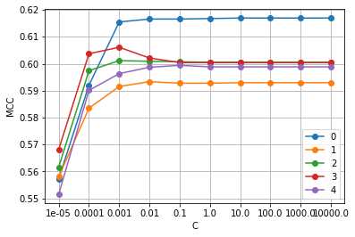
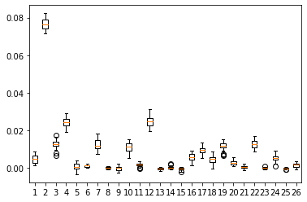
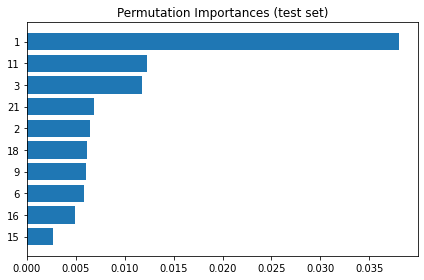

# Survey Item Importance

A classification pipeline that answers a simple question: **which questions in a survey actually matter, and which ones can you drop?**

## Why this is useful

Surveys are often too long. People get tired, drop off, or answer carelessly. Cutting questions blindly risks losing information. This pipeline gives you a defensible way to decide:

- Rank each question by how much it contributes to predicting a target (segment, NPS, purchase intent, and so on)
- Drop the low-signal ones with confidence
- Keep the questionnaire short without losing what you care about

The same code works whether the target is a customer segment, a satisfaction bucket, or anything else categorical.

## The data

A public dataset from [openpsychometrics.org](https://openpsychometrics.org/tests/OSRI/development/). Roughly 30,000 people answered 44 short questions on a 1-5 scale about everyday behaviors ("I use lotion on my hands", "I have thrown knives", "I bake sweets just for myself"). They also self-reported basic demographics.

The CSV isn't shipped in this repo, it's a public download.

## What the pipeline does

1. Load the data and keep 26 of the 44 items as features.
2. Split 75% training / 25% test.
3. Standardize the features.
4. Tune the regularization strength with 5-fold cross-validation on the training set.
5. Refit the best model on the full training set.
6. Bootstrap the test set 100 times to get a confidence interval on performance.
7. Compute permutation importance to see which questions the model actually uses.
8. Run two sanity checks: swap to a different classifier (SVC), and shuffle the labels to confirm performance collapses to zero.

Full run in `notebook/pipeline.ipynb`.

## Results

### Choosing the regularization strength

Performance (MCC) across five cross-validation folds as the regularization strength `C` changes. The curves flatten once `C` is strong enough. `C = 0.001` was picked at the shoulder to keep the model conservative.

### All questions, ranked by contribution

One box per question, showing how much test performance drops when you shuffle that question's answers. Most boxes sit near zero: the model isn't using those questions. A handful stand out, and one dominates. **This is the "which questions am I actually paying for" chart.**

### The top ten questions

Same information, filtered to the top 10 and sorted. This is the deliverable for a survey team: the ranked list of questions to keep.

When you look up what each of the top questions asks, the ranking makes sense: clothing and cosmetics, weapons and physical risk, handmade gifts, taking apart machines. Nothing random.

### Headline number

Test MCC around 0.60 with a tight confidence interval. When the labels are shuffled, MCC collapses near zero, confirming the signal is real. Swapping the classifier gives a similar result, confirming it isn't a quirk of logistic regression.

## Technical choices worth noting

- **MCC instead of accuracy.** MCC handles class imbalance and gives a clean zero at chance. Accuracy would be misleading with unbalanced classes.
- **Permutation importance instead of coefficients.** With correlated Likert items, coefficients get redistributed by the regularization and stop being trustworthy. Permutation importance measures real predictive contribution on held-out data.
- **Bootstrap confidence intervals.** A single number is fragile. A range is defensible.
- **Two sanity checks, not one.** Model swap catches classifier-specific quirks. Label shuffle catches leakage. You need both.

## Repo structure
